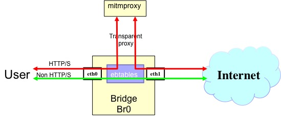
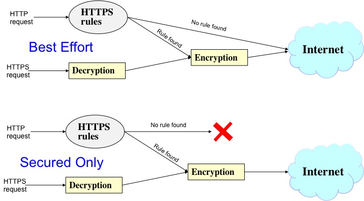

# 1. End-user 

## 1.1 Description / general readme

Re-encryption PSA allows the user to enjoy of a safety browsing experience, independent of the operative system or browser version when they happen through HTTP protocol.  It keeps a continuous monitoring of all user connections to Internet that use the SSL/TLS version of HTTP or also known as HTTPS. If detect a weak or vulnerable version allows to modify in-the-fly the configuration of the traffic to use the most secure version. Also it can be configured to deny HTTP (without SSL/TLS).

## 1.2 Features / Capabilities

In each of the devices you will use with this PSA it is recommended to install the PSA certificates, to avoid warning messages shown by the browser that there is an unknown certificate authority.  Just visit <http://mitm.it> and follow the instructions.

The list of capabilities are (extracted from manifest):

* URL rewriting
* Integrity and confidenciality based on encryption.

## 1.3 Security policy examples

The following examples list *all the possibly policies* that can be enabled from the SECURED GGUI.

```I protect confidentiality integrity internet traffic ( type of content , {web} ) ```
- This policy enables PSA-reencrypt with the only secure mode. This means protect all HTTP and HTTPS and therefore block traffic when the site do not offer HTTPS access. This is and aggresive mode, because can affect the browsing experience, but at the same time offer the most secure browsing experience.   

```I protect confidentiality integrity internet traffic ( type of content , {secure_web} ) ```
- This policy enables PSA-reencrypt with the best effort mode. This means protect only HTTPS and therefore allow traffic when the site do not offer HTTPS access. This mode guarantee always connectivity, but at the same time allows non secure traffic.   

 
## 1.4 Support, troubleshooting / known issues

If there are any known issues, list them here.

Some applications employ [Certificate Pinning](http://security.stackexchange.com/questions/29988/what-is-certificate-pinning) and some servers implement [HSTS](https://tools.ietf.org/html/rfc6797) to prevent man-in-the-middle attacks. This means that PSA’s certificates will not be accepted by these applications without modifying them. In order  to bypass this problems, the PSA must be modified to ignore this domains. This functionality is not yet supported. 

# 2. Developer / admin

## Description / general readme

Re-encryption PSA has born with the aim to make web communications through the  Internet as secure as if the user is fully updated.

In recent years new attacks against SSL/TLS protocol are discovered everyday. Some representative examples are:
* [FREAK](https://freakattack.com/) allows an attacker to intercept HTTPS connections between vulnerable clients and servers and force them to use weakened encryption, which the attacker can break to steal or manipulate sensitive data
* [Heartbleed](<https://cve.mitre.org/cgi-bin/cvename.cgi?name=CVE-2014-0160>) abuse from a vulnerability in openSSL implementation of heartbeat extension (RFC6520)
* [CRIME](https://web.nvd.nist.gov/view/vuln/detail?vulnId=CVE-2012-4929) or 'Compression Ratio Info-leak Made Easy' allows session cookies leakage using a vulnerability in TLS compress algorithm
* [BEAST](http://www.cve.mitre.org/cgi-bin/cvename.cgi?name=CVE- 2011-3389) or 'Browser Exploit Against SSL/TLS' affects to TLS 1.0 and earlier with a serious flaw: the Initialization Vector (IV) blocks that are used to mask data (plaintext) prior to encryption with a block cipher can be predicted by an active man-in-the-middle (MITM) attacker
* [POODLE](https://cve.mitre.org/cgi-bin/cvename.cgi?name=CVE-2014-3566) or 'Padding Oracle On Downgraded Legacy Encryption' affects to SSL 3.0, because uses nondeterministic CBC padding, which makes it easier for man-in-the-middle attackers to obtain cleartext data

It well known that most of them are preventable using an updated configuration on the server and in the client, like disable SSL protocol,  use latest version of TLS protocol (TLSv1.2), use only secure ciphers suites or use latest version of applications (e.g. OpenSSL). The reality is that this recommendations are not so common  followed because several reasons:
*   Old devices in services
*   Discontinued systems (e.g. Windows XP)
*   Broken dependencies that do not allow update applications
*   Closed platforms (SmartTV, IoT)

As part of the SECURED model this reencryption PSA allows to bypass this restrictions acting as a transparent proxy in all HTTP/S communications. It terminates all HTTP sessions and creates a new one based on HTTPS with the most robust and secure TLS version.


Conceptually this PSA is transparent to user, once it is enabled from the NED client once PSA root CA is installed in the browser. Details of the installation process of the certificates are available in the maintenance section. 

## Components and Requirements

VM technology allows creating a full system for the PSA. The components used in this PSA are:

* Operative System: Debian 7 "wheezy"
* iptables 
* ebtables
* mitmproxy (<https://mitmproxy.org/>)
* brigde-utils

The most important requirement is the need of an IP address in the PSA belonging to the same LAN than End user. 


## Detailed architecture

There are several components in the internal architecture:

* **Transparent HTTP/S redirection**. iptables and **ebtables** allows to implement a transparent redirection of the HTTP and HTTPS traffic in the bridge from the user side interface to the proxy component and also re-inject to the internet side interface the traffic generated by the proxy. The rest of the traffic pass through the bridge.



* **Reencryption**. Module in charge of finalizes all HTTP and HTTPS connections and regenerate new ones when they are weaks. Acts as a transparent HTTP/S proxy of all the traffic reaching the PSA IP address. Also manages Certificates Authority (CA) and certificates generation. This functionality is made by [mitmproxy](http://mitmproxy.org/doc/howmitmproxy.html) 
* **URL rules**. This module apply to HTTP (non SSL/TLS) traffic and before progressing the request check if exists a equivalent HTTPS url using the created and maintained list from [HTTPSeverywhere](https://www.eff.org/https-everywhere)

The next figure shows the basic behavioural of the PSA where the user can choose to configure a "best effort", or a "secured-only" access. First one allow insecure browsing if not strongest HTTPS cipher suite is possible. On the contrary secured-only mode, block any browsing traffic if cannot be encrypted.




### Rules

Some web portals and content providers, apply their own policy in HTTPS implementation. For example different URLs when you access to HTTP than when you use HTTPS, default to unencrypted HTTP, or fill encrypted pages with links that go back to the unencrypted site. HTTPS Everywhere provides and maintain a [Ruleset](https://github.com/EFForg/https-everywhere/tree/master/src/chrome/content/rules/) of the correct URLS to keep traffic in HTTPS. 

Each HTTP request that arrives to this PSA is analysed (extracting the URL) and checked against the HTTPSEverywhere list. If there is match, then reencryption-PSA starts a HTTPS session with the new URL, this way user traffic is protected when there is availability. 

### Certificates

The first time mitmdump is run, the mitmproxy Certificate Authority(CA) is created in the config directory ($HOME/pythonScript/mitmdump/.mitmproxy). This CA is used for on-the-fly generation of dummy certificates for each of the SSL sites that the user visits. As a developer you can decide to [change it](http://docs.mitmproxy.org/en/stable/certinstall.html#using-a-custom-certificate-authority) by other self-signed that identify better the PSA.  

Also from the point of view of the real upstream server where user wants to access, reencryption PSA verifies Server SSL/TLS certificates. Reencryption PSA includes a list of [Mozilla's list of trusted root certificates](https://hg.mozilla.org/mozilla-central/raw-file/tip/security/nss/lib/ckfw/builtins/certdata.txt). If real server certificate is invalid or not present then the connection fails.

### Cypher suites

To allow users to select the level of security that suits their needs, and to enable communication with others who might have different needs, SSL/TLS defines cipher suites, or sets of ciphers
When an SSL/TLS connection is established, during the SSL/TLS handshake, the client and server exchange information about which cipher suites they have in common. They then communicate using the common cipher suite that offers the highest level of security. If there is no agreement no communication happens. Update [list](https://www.iana.org/assignments/tls-parameters/tls-parameters.xhtml#tls-parameters-4) of available standardized cypher suites is maintained by IANA.

Reencryption PSA proxy functionality acts as a web server to the clients to end the communications and also acts as a client to establish new TLS session with the real destination. In order to support insecure legacy devices and client applications, the server functionality of the PSA allows ALL type of cypher suites, so never failed the SSL/TLS handshake. On the contrary when acts as a client usually it is recommended to support only most robust cypher suites, but with some backward compatibility. This values it will configurable via MSPL language and translated by M2LPlugin. 

### Protocol
For the same reason of previous cypher suites, Reencryption PSA proxy functionality also needs to be able to manage different protocols and versions. In the client side (acting as a server) can support ANY kind of protocol (SSLv2, SSLv3, TLSv1.0, TLSv1.1 and TLSv1.2) and acting as a client we can enforce TLSv1.2 against the real server.

## Virtual machine image creation

The procedure to create a valid PSA image from scratch starts with the prerequisite instructions defined in the PSA Developer guide. 

Install the software mitmproxy. Instructions are available at:  [mitmproxy](http://mitmproxy.org/doc/install.html)

Copy the necessary [files](https://github.com/SECURED-FP7/secured-psa-reencrypt/tree/master/PSA) of this project in the folder:

```
$HOME/pythonScript/
```

Change passwords for user 'root' and user 'psa' for security reasons.

## Support, troubleshooting / known issues

Due the fact that some of the most relevant SSL/TLS vulnerabilities affects to open source openSSL software and libraries it is highly recomended to update this packages and rebuild the image to keep the functionality promised of protect the user of this vulnerabilities. Follow the operative system update process to keep this library in the last version, e.g. in Ubuntu: ```apt-get update ; apt-get upgrade``` 

This PSA apart from be part of the SECURED architecture requires some interactions from the user the first time it is used from a browser.

When the user connects first time it will see an Certificate Error in the browser. The user must connect to the web page <http://mitm.it> and follow the steps to download and install the root CA. 
Detailed documentation of the Certificate management are available in: <https://mitmproxy.org/doc/certinstall.html>.

## Files required

In order to make PSA running correctly it is needed a set of files to be provided to SECURED components

### PSA application image

PSA is based on a Virtual machine image in KVM- kernel module format ".qcow2". A [sample image has been included](https://github.com/SECURED-FP7/secured-psa-reencrypt/blob/master/reencrypt.qcow2) in the project.

### Manifest

The PSA manifest is available at [Manifest](NED_files/TVDM/PSAManifest/reencrypt_manifest.xml) . And reflects the capabilities describe below. 

This file must be store in the PSAR.

### HSPL

The HSLP is define as follows:

* D4.1 Format:

```I protect confidentiality integrity internet traffic ( type of content , {web} ) ```
```I protect confidentiality integrity internet traffic ( type of content , {secure_web} ) ```

* More friendly expression

		Protect communications integrity and confidentiality for internet traffic
		where
		-integrity and confidentiality -> (security_property=integrity AND confidentiality)
		-for internet traffic -> (type_of_content=web)

### MSPL

Several examples of MSPL for this PSA are accesible at SPM project.

[best_effort.xml](https://github.com/SECURED-FP7/secured-spm/blob/M2LService/M2LService/code/M2LReencyrptionPlugin/MSPL_best_effort.xml) is an optimized configuration to allow strongest cyphersuites and allow HTTP browsing.

[only_secure.xml](https://github.com/SECURED-FP7/secured-spm/blob/M2LService/M2LService/code/M2LReencyrptionPlugin/MSPL_only_secure.xml) is an optimized configuration to allow strongest cyphersuites and never HTTP browsing.
 

### M2L Plug-in

The M2l plug-in is available at [M2LPlugin](https://github.com/SECURED-FP7/secured-spm/blob/M2LService/M2LService/code/M2LReencyrptionPlugin/src/eu/securedfp7/m2lservice/plugin/M2LPlugin.java)

Current version of this plugin will generate different possible low level configurations. Some examples are available at [Config](NED_files/TVDM/psaConfigs/fdcdc64e-6006-40b8-8e2f-a4bddc38d43e/) 

This plugin do not need additional external information in this version that must be store in the PSAR.


## Features/Capabilities

The list of capabilities are (extracted from manifest):

* TLS_protocol
* Protection_integrity
* Protection_confidentiality
* Reencrypt

## Testing

Testing scripts are available at [test folder](tests/)


# 3. License

Please refer to project LICENSE file.

This software incorporate several open source programs with their own license:
* mitmproxy available at [license](https://github.com/mitmproxy/mitmproxy/blob/master/LICENSE)
* HTPSEverywhere available at [license](https://github.com/EFForg/https-everywhere/blob/master/LICENSE.txt)
